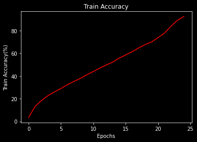
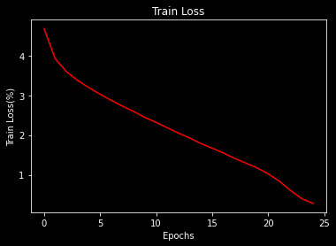
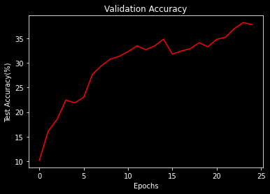
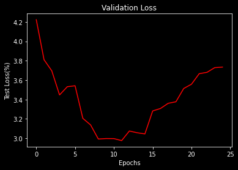

# S10 Assignment

## Assignment A

    Download this  TINY IMAGENET dataset. 

        Train ResNet18 on this dataset (70/30 split) for 50 Epochs. Target 50%+ Validation Accuracy.

        Submit Results. Of course, you are using your own package for everything. You can look at  this  for reference. 
        
        
**Assignment Solution**: [TinyImageNet_ResNet18](https://github.com/Gilf641/EVA-6/blob/master/Assignments/S10/EVA6_S10(TinyImageNet).ipynb)

### **Model Features:**

1. Used GPU
2. ResNet Variant: ResNet18
3. Total Params: 11,279,112

4. Used NLLoss() to calculate loss value.
5. Used OneCycleLr as LR Scheduler, with max lr as 0.35
6. Ran the model for 20 Epochs with 

    * Highest Train Accuracy: 92.540% 

    * Corresponding Test Accuracy: 37.772% 

  
        
* **Model Features:**

1. Used GPU
2. Receptive Field = 1300
3. Total Params = 4_058_122
4. Ran the model for 24 Epochs
5. Max Validation Accuracy = 38.2%

## **Model Analysis**
1. Lot of fluctuations in Validation Acc values. 
2. Overfit Model, need to add Dropout.

## Model Performance Analysis

|Accuracy| Loss|
|-------------------------|-------------------------|
|||
|||

* **Misclassified images**

* **Gradcam Output**

# Analysis

1. Network is severly overfitting.
2. OnecycleLr has affected and improved model accuracy rate.
3. Adding Data Augmentations can reduce Overfitting.

