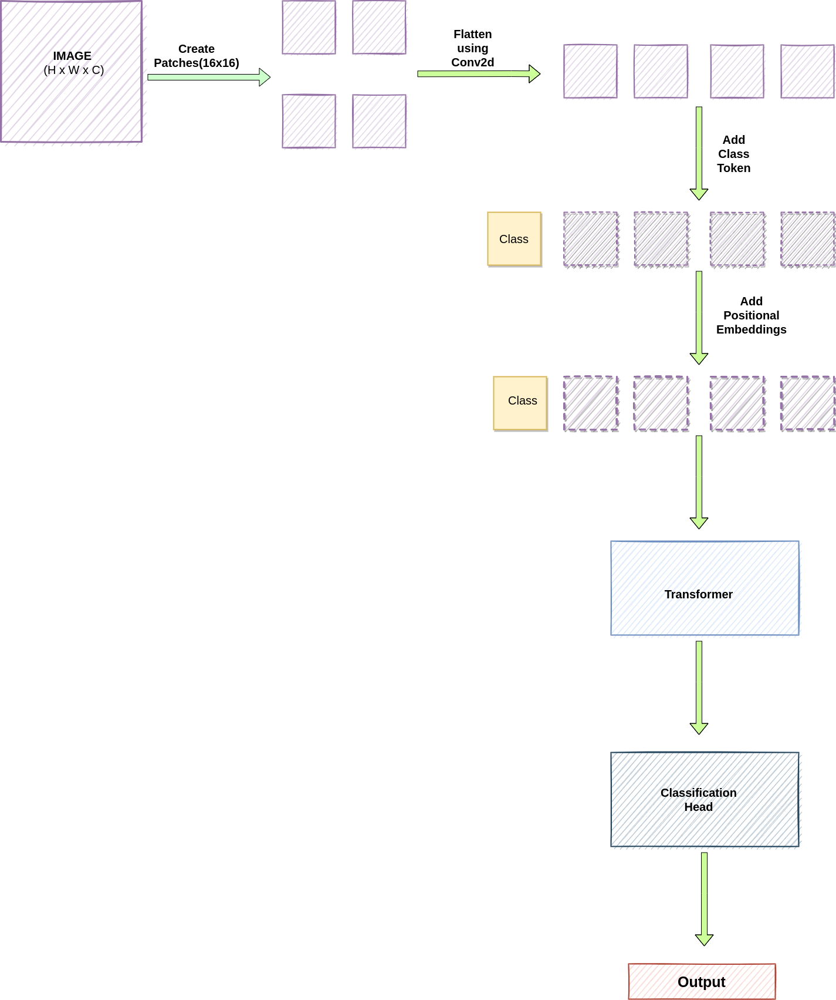
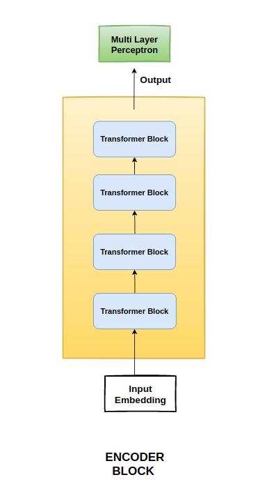
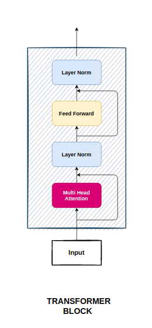
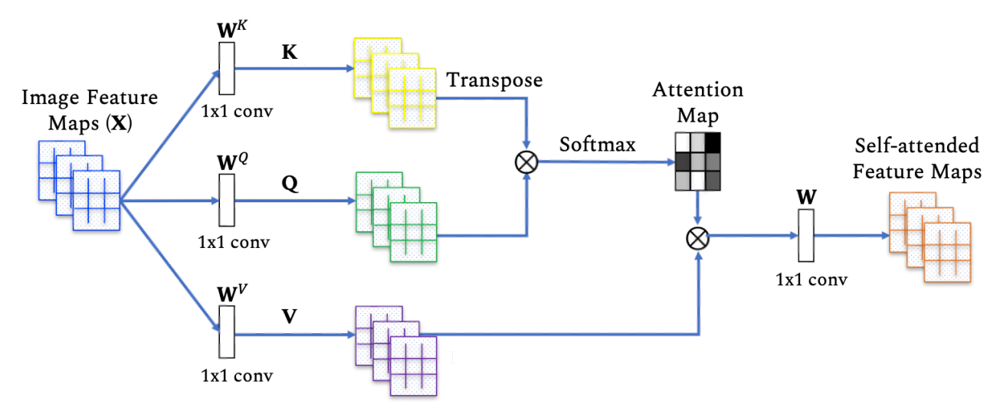
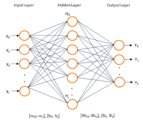

# Vision Transformer

Objective is to explain Vision Transformers, Transformer-based architectures for Computer Vision Tasks as proposed in the paper An Image is Worth 16x16 Words: Transformers for Image Recognition at Scale by Alexey Dosovitskiy, Lucas Beyer, Alexander Kolesnikov, Dirk Weissenborn, Xiaohua Zhai, Thomas Unterthiner, Mostafa Dehghani, Matthias Minderer, Georg Heigold, Sylvain Gelly, Jakob Uszkoreit, Neil Houlsby.

Transformers have been the de-facto for NLP tasks, and CNN/Resnet-like architectures have been the state of the art for Computer Vision. This paper mainly discusses the strength and versatility of vision transformers, as it kind of approves that they can be used in recognition and can even beat the state-of-the-art CNN.

Following classes from this implementation will be explained block by block:

    Embeddings
    Encoder
    Block
    Attention
    MLP

## ViT Flow 




### 1. Embeddings

   * After dividing the input image into patches of size 16x16(in this example), it should be flattened. It's done through Conv2d layer and is applied indiviually to each patch. 

   * Class Token and Position Embedding will be added after this. Token one is just a number placed infront of each sequence, while position embedding helps with spatial info. 


```
  class Embeddings(nn.Module):
      """Construct the embeddings from patch, position embeddings.
      """
      def __init__(self, config, img_size, in_channels=3):
          super(Embeddings, self).__init__()
          self.hybrid = None
          img_size = _pair(img_size)

          if config.patches.get("grid") is not None:
              grid_size = config.patches["grid"]
              patch_size = (img_size[0] // 16 // grid_size[0], img_size[1] // 16 // grid_size[1])
              n_patches = (img_size[0] // 16) * (img_size[1] // 16)
              self.hybrid = True
          else:
              patch_size = _pair(config.patches["size"])
              n_patches = (img_size[0] // patch_size[0]) * (img_size[1] // patch_size[1])
              self.hybrid = False

          if self.hybrid:
              self.hybrid_model = ResNetV2(block_units=config.resnet.num_layers,
                                           width_factor=config.resnet.width_factor)
              in_channels = self.hybrid_model.width * 16
          self.patch_embeddings = Conv2d(in_channels=in_channels,
                                         out_channels=config.hidden_size,
                                         kernel_size=patch_size,
                                         stride=patch_size)
          self.position_embeddings = nn.Parameter(torch.zeros(1, n_patches+1, config.hidden_size))
          self.cls_token = nn.Parameter(torch.zeros(1, 1, config.hidden_size))

          self.dropout = Dropout(config.transformer["dropout_rate"])

      def forward(self, x):
          B = x.shape[0]
          cls_tokens = self.cls_token.expand(B, -1, -1)

          if self.hybrid:
              x = self.hybrid_model(x)
          x = self.patch_embeddings(x)
          x = x.flatten(2)
          x = x.transpose(-1, -2)
          x = torch.cat((cls_tokens, x), dim=1)

          embeddings = x + self.position_embeddings
          embeddings = self.dropout(embeddings)
          return embeddings
```


### 2. Encoder 
Embeddings result is passed as an input to Transformer. Encoder Module consists both Attention and Perceptron Layers. It has a sequence of Transformer blocks. 


|||
```

    class Encoder(nn.Module):
        def __init__(self, config, vis):
            super(Encoder, self).__init__()
            self.vis = vis
            self.layer = nn.ModuleList()
            self.encoder_norm = LayerNorm(config.hidden_size, eps=1e-6)
            for _ in range(config.transformer["num_layers"]):
                layer = Block(config, vis)
                self.layer.append(copy.deepcopy(layer))

        def forward(self, hidden_states):
            attn_weights = []
            for layer_block in self.layer:
                hidden_states, weights = layer_block(hidden_states)
                if self.vis:
                    attn_weights.append(weights)
            encoded = self.encoder_norm(hidden_states)
            return encoded, attn_weights

```


### 3. Block 

Block seems like the main class which combines both attention and MLP module. It also has layer norm, dropout and residual connections within. There are two blocks one with Attention and other one has FeedForward network. 


```

    class Block(nn.Module):
        def __init__(self, config, vis):
            super(Block, self).__init__()
            self.hidden_size = config.hidden_size
            self.attention_norm = LayerNorm(config.hidden_size, eps=1e-6)
            self.ffn_norm = LayerNorm(config.hidden_size, eps=1e-6)
            self.ffn = Mlp(config)
            self.attn = Attention(config, vis)

        def forward(self, x):
            h = x
            x = self.attention_norm(x)
            x, weights = self.attn(x)
            x = x + h

            h = x
            x = self.ffn_norm(x)
            x = self.ffn(x)
            x = x + h
            return x, weights
```

### 4. Attention

Attention module takes in the embedding sequence as the input. There's also a normalization layer before passing input to attention. Attention Module takes in three inputs, Queries, Keys and Values. Multiplying Queries with Keys will give Attention Map which can then be used to attent values. Multi-Head Attention does the same thing with N number of heads. 

Module Features/Flow:

* 4 Fully Connected Layers, 1 for Key, Query and Value each + 1 for Output
* Attention = Softmax(Resulting Vector)/Size of Embedding
* To get context, Attention vector is multiplied with values. 



```
  class Attention(nn.Module):
      def __init__(self, config, vis):
          super(Attention, self).__init__()
          self.vis = vis
          self.num_attention_heads = config.transformer["num_heads"]
          self.attention_head_size = int(config.hidden_size / self.num_attention_heads)
          self.all_head_size = self.num_attention_heads * self.attention_head_size

          self.query = Linear(config.hidden_size, self.all_head_size)
          self.key = Linear(config.hidden_size, self.all_head_size)
          self.value = Linear(config.hidden_size, self.all_head_size)

          self.out = Linear(config.hidden_size, config.hidden_size)
          self.attn_dropout = Dropout(config.transformer["attention_dropout_rate"])
          self.proj_dropout = Dropout(config.transformer["attention_dropout_rate"])

          self.softmax = Softmax(dim=-1)

      def transpose_for_scores(self, x):
          new_x_shape = x.size()[:-1] + (self.num_attention_heads, self.attention_head_size)
          x = x.view(*new_x_shape)
          return x.permute(0, 2, 1, 3)

      def forward(self, hidden_states):
          mixed_query_layer = self.query(hidden_states)
          mixed_key_layer = self.key(hidden_states)
          mixed_value_layer = self.value(hidden_states)

          query_layer = self.transpose_for_scores(mixed_query_layer)
          key_layer = self.transpose_for_scores(mixed_key_layer)
          value_layer = self.transpose_for_scores(mixed_value_layer)

          attention_scores = torch.matmul(query_layer, key_layer.transpose(-1, -2))
          attention_scores = attention_scores / math.sqrt(self.attention_head_size)
          attention_probs = self.softmax(attention_scores)
          weights = attention_probs if self.vis else None
          attention_probs = self.attn_dropout(attention_probs)

          context_layer = torch.matmul(attention_probs, value_layer)
          context_layer = context_layer.permute(0, 2, 1, 3).contiguous()
          new_context_layer_shape = context_layer.size()[:-2] + (self.all_head_size,)
          context_layer = context_layer.view(*new_context_layer_shape)
          attention_output = self.out(context_layer)
          attention_output = self.proj_dropout(attention_output)
          return attention_output, weights


```

### 5. MLP aka Multi-Layer Perceptron

 A multilayer perceptron (MLP) is a feedforward neural network that generates a set of outputs from a set of inputs passed. An MLP is characterized by several layers of input nodes connected as a directed graph between the input and output layers. MLP uses backpropogation for training the network.

 