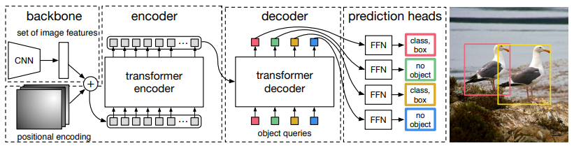
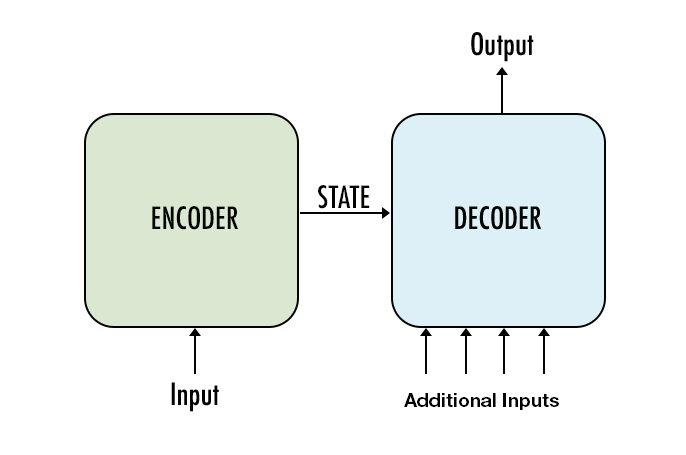

###  DETR

Detection Transformers or DETR in short is Transformer-based Object Detection network. The network eliminates explicit tasks such as Non-Maximum Suppression, Anchor Box generation etc. DETR tries to map the relationship b/w the object and whole image. It is a Transformer Encoder-Decoder based architecture. It uses Bipartite matching as it's loss function which outputs unique predictions.

### Encoder-Decoder Architecture

DETR uses Convolutions to get Embeddings which is the input of Encoder block. Particularly it uses ResNet-50. To these embeddings, positional encodings are added, which are either learned or generated. 

Major difference b/w Encoder and Decoder block is that there's one Guided Attention Layer in the Decoder. Other than that, both have one Self-Attention layer. 

Encoder receives input from ResNet-50, while Decoder receives Object Queries, which are learned params. Self-Attention Layer improves these queries, which are passed as input for the next attention layer. Decoder Output is passed onto a Prediction head, which is responsible for final prediction.

### Bipartite Loss
It is a optimization algorithm that helps in solving assignment problem. 

    Assignment Problem
        The problem has a number of agents and tasks. Any agent can
        be assigned to perform any task, incurring some cost that may
        vary depending on agent-task assignment. It is required to perform as
        many tasks as many possible by assigning at most one agent to
        each task and vice-versa. This should be done in such a way
        that total cost of the assignment is minimized. 

What we're dealing is unbalanced assignment in some cases, where we might **m** ground truths and **n** predictions. But in some instances it might be balanced one. 

 

        Lmatch(yi,y^σ(i)) = −I{ci≠∅}p^i(ci)+I{ci≠∅}Lbox(bi,b^σ(i))
            where, Lbox(bi,b^σ(i)) = λiouLiou(bi,b^σ(i))+λL1∥bσ(i)−b^i∥1

        

This algorithm is able to reduce low-quality predictions and achieve eliminations of output reductions like NMS. 

### Object Queries
The Decoder in DETR has one extra input called Object Queries/Positional Encodings. These are **n** learned nn.Parameter(Vectors/Encodings) and this finally results in **n** bounding boxes.
The only difference b/w Object Queries and Anchor Boxes, is that former one learn about Box Location, while latter ones focus on learning about Box sizes. 

These input queries are being transformed as improvized queries, which are passed as query for second attention block. 

### DETR on Custom Dataset(Fire Extinguishers)

##### Model Logs:

        sha: e42a3b174d2325c28f82d7114138c755ac7c095a, status: clean, branch: finetune

        Namespace(aux_loss=True, backbone='resnet50', batch_size=2, bbox_loss_coef=5, clip_max_norm=0.1, coco_panoptic_path=None, coco_path='/content/drive/MyDrive/fire_extinguishers', dataset_file='custom', dec_layers=6, device='cuda', dice_loss_coef=1, dilation=False, dim_feedforward=2048, dist_url='env://', distributed=False, dropout=0.1, enc_layers=6, eos_coef=0.1, epochs=5, eval=False, frozen_weights=None, giou_loss_coef=2, hidden_dim=256, lr=0.0001, lr_backbone=1e-05, lr_drop=200, mask_loss_coef=1, masks=False, nheads=8, num_classes=2, num_queries=100, num_workers=2, output_dir='outputs', position_embedding='sine', pre_norm=False, remove_difficult=False, resume='detr-r50_no-class-head.pth', seed=42, set_cost_bbox=5, set_cost_class=1, set_cost_giou=2, start_epoch=0, weight_decay=0.0001, world_size=1)
        number of params: 41279495
        loading annotations into memory...
        Done (t=0.00s)
        creating index...
        index created!
        loading annotations into memory...
        Done (t=0.00s)
        creating index...
        index created!
        Start training
        Epoch: [0]  [ 0/63]  eta: 0:01:15  lr: 0.000100  class_error: 0.00  loss: 12.2860 (12.2860)  loss_ce: 1.5265 (1.5265)  loss_bbox: 0.3963 (0.3963)  loss_giou: 0.1359 (0.1359)  loss_ce_0: 1.4731 (1.4731)  loss_bbox_0: 0.4833 (0.4833)  loss_giou_0: 0.1767 (0.1767)  loss_ce_1: 1.5139 (1.5139)  loss_bbox_1: 0.3079 (0.3079)  loss_giou_1: 0.1068 (0.1068)  loss_ce_2: 1.4986 (1.4986)  loss_bbox_2: 0.4269 (0.4269)  loss_giou_2: 0.1690 (0.1690)  loss_ce_3: 1.5184 (1.5184)  loss_bbox_3: 0.3909 (0.3909)  loss_giou_3: 0.1284 (0.1284)  loss_ce_4: 1.5407 (1.5407)  loss_bbox_4: 0.3671 (0.3671)  loss_giou_4: 0.1256 (0.1256)  loss_ce_unscaled: 1.5265 (1.5265)  class_error_unscaled: 0.0000 (0.0000)  loss_bbox_unscaled: 0.0793 (0.0793)  loss_giou_unscaled: 0.0679 (0.0679)  cardinality_error_unscaled: 98.5000 (98.5000)  loss_ce_0_unscaled: 1.4731 (1.4731)  loss_bbox_0_unscaled: 0.0967 (0.0967)  loss_giou_0_unscaled: 0.0884 (0.0884)  cardinality_error_0_unscaled: 97.0000 (97.0000)  loss_ce_1_unscaled: 1.5139 (1.5139)  loss_bbox_1_unscaled: 0.0616 (0.0616)  loss_giou_1_unscaled: 0.0534 (0.0534)  cardinality_error_1_unscaled: 99.0000 (99.0000)  loss_ce_2_unscaled: 1.4986 (1.4986)  loss_bbox_2_unscaled: 0.0854 (0.0854)  loss_giou_2_unscaled: 0.0845 (0.0845)  cardinality_error_2_unscaled: 99.0000 (99.0000)  loss_ce_3_unscaled: 1.5184 (1.5184)  loss_bbox_3_unscaled: 0.0782 (0.0782)  loss_giou_3_unscaled: 0.0642 (0.0642)  cardinality_error_3_unscaled: 98.0000 (98.0000)  loss_ce_4_unscaled: 1.5407 (1.5407)  loss_bbox_4_unscaled: 0.0734 (0.0734)  loss_giou_4_unscaled: 0.0628 (0.0628)  cardinality_error_4_unscaled: 98.5000 (98.5000)  time: 1.2027  data: 0.2264  max mem: 1188
        Epoch: [0]  [10/63]  eta: 0:00:42  lr: 0.000100  class_error: 100.00  loss: 5.9923 (7.1036)  loss_ce: 0.6146 (0.7420)  loss_bbox: 0.1651 (0.1883)  loss_giou: 0.1209 (0.1090)  loss_ce_0: 0.8394 (0.9760)  loss_bbox_0: 0.1659 (0.2609)  loss_giou_0: 0.1436 (0.1578)  loss_ce_1: 0.7920 (0.9237)  loss_bbox_1: 0.1529 (0.1952)  loss_giou_1: 0.0923 (0.1271)  loss_ce_2: 0.6940 (0.8543)  loss_bbox_2: 0.1947 (0.2420)  loss_giou_2: 0.0793 (0.1167)  loss_ce_3: 0.6331 (0.8029)  loss_bbox_3: 0.1821 (0.2182)  loss_giou_3: 0.1110 (0.1203)  loss_ce_4: 0.6267 (0.7729)  loss_bbox_4: 0.1734 (0.1853)  loss_giou_4: 0.1136 (0.1110)  loss_ce_unscaled: 0.6146 (0.7420)  class_error_unscaled: 100.0000 (86.3636)  loss_bbox_unscaled: 0.0330 (0.0377)  loss_giou_unscaled: 0.0605 (0.0545)  cardinality_error_unscaled: 7.0000 (27.2273)  loss_ce_0_unscaled: 0.8394 (0.9760)  loss_bbox_0_unscaled: 0.0332 (0.0522)  loss_giou_0_unscaled: 0.0718 (0.0789)  cardinality_error_0_unscaled: 38.5000 (56.1364)  loss_ce_1_unscaled: 0.7920 (0.9237)  loss_bbox_1_unscaled: 0.0306 (0.0390)  loss_giou_1_unscaled: 0.0461 (0.0636)  cardinality_error_1_unscaled: 39.0000 (47.2727)  loss_ce_2_unscaled: 0.6940 (0.8543)  loss_bbox_2_unscaled: 0.0389 (0.0484)  loss_giou_2_unscaled: 0.0397 (0.0583)  cardinality_error_2_unscaled: 12.0000 (37.7727)  loss_ce_3_unscaled: 0.6331 (0.8029)  loss_bbox_3_unscaled: 0.0364 (0.0436)  loss_giou_3_unscaled: 0.0555 (0.0602)  cardinality_error_3_unscaled: 9.0000 (34.0455)  loss_ce_4_unscaled: 0.6267 (0.7729)  loss_bbox_4_unscaled: 0.0347 (0.0371)  loss_giou_4_unscaled: 0.0568 (0.0555)  cardinality_error_4_unscaled: 12.0000 (31.5455)  time: 0.8018  data: 0.0349  max mem: 2986
        Epoch: [0]  [20/63]  eta: 0:00:34  lr: 0.000100  class_error: 100.00  loss: 5.5980 (6.6347)  loss_ce: 0.4429 (0.6120)  loss_bbox: 0.1651 (0.2438)  loss_giou: 0.1112 (0.1526)  loss_ce_0: 0.7122 (0.7914)  loss_bbox_0: 0.1939 (0.3067)  loss_giou_0: 0.1207 (0.1886)  loss_ce_1: 0.6079 (0.7366)  loss_bbox_1: 0.1376 (0.2512)  loss_giou_1: 0.0837 (0.1616)  loss_ce_2: 0.5709 (0.6757)  loss_bbox_2: 0.1704 (0.2704)  loss_giou_2: 0.0894 (0.1600)  loss_ce_3: 0.5171 (0.6436)  loss_bbox_3: 0.1597 (0.2617)  loss_giou_3: 0.1032 (0.1590)  loss_ce_4: 0.4791 (0.6226)  loss_bbox_4: 0.1664 (0.2453)  loss_giou_4: 0.0989 (0.1520)  loss_ce_unscaled: 0.4429 (0.6120)  class_error_unscaled: 100.0000 (92.8571)  loss_bbox_unscaled: 0.0330 (0.0488)  loss_giou_unscaled: 0.0556 (0.0763)  cardinality_error_unscaled: 1.0000 (14.9524)  loss_ce_0_unscaled: 0.7122 (0.7914)  loss_bbox_0_unscaled: 0.0388 (0.0613)  loss_giou_0_unscaled: 0.0604 (0.0943)  cardinality_error_0_unscaled: 5.5000 (30.6190)  loss_ce_1_unscaled: 0.6079 (0.7366)  loss_bbox_1_unscaled: 0.0275 (0.0502)  loss_giou_1_unscaled: 0.0419 (0.0808)  cardinality_error_1_unscaled: 4.0000 (25.5476)  loss_ce_2_unscaled: 0.5709 (0.6757)  loss_bbox_2_unscaled: 0.0341 (0.0541)  loss_giou_2_unscaled: 0.0447 (0.0800)  cardinality_error_2_unscaled: 1.5000 (20.5000)  loss_ce_3_unscaled: 0.5171 (0.6436)  loss_bbox_3_unscaled: 0.0319 (0.0523)  loss_giou_3_unscaled: 0.0516 (0.0795)  cardinality_error_3_unscaled: 1.0000 (18.5238)  loss_ce_4_unscaled: 0.4791 (0.6226)  loss_bbox_4_unscaled: 0.0333 (0.0491)  loss_giou_4_unscaled: 0.0494 (0.0760)  cardinality_error_4_unscaled: 1.0000 (17.1905)  time: 0.7918  data: 0.0163  max mem: 2986
        Epoch: [0]  [30/63]  eta: 0:00:26  lr: 0.000100  class_error: 100.00  loss: 3.9554 (6.0563)  loss_ce: 0.3652 (0.5460)  loss_bbox: 0.1577 (0.2389)  loss_giou: 0.1112 (0.1491)  loss_ce_0: 0.4846 (0.6900)  loss_bbox_0: 0.2160 (0.2985)  loss_giou_0: 0.1294 (0.1892)  loss_ce_1: 0.4459 (0.6385)  loss_bbox_1: 0.1644 (0.2549)  loss_giou_1: 0.1208 (0.1588)  loss_ce_2: 0.3983 (0.5895)  loss_bbox_2: 0.1320 (0.2639)  loss_giou_2: 0.1023 (0.1508)  loss_ce_3: 0.3731 (0.5633)  loss_bbox_3: 0.1500 (0.2412)  loss_giou_3: 0.1032 (0.1496)  loss_ce_4: 0.3617 (0.5500)  loss_bbox_4: 0.1555 (0.2375)  loss_giou_4: 0.0979 (0.1465)  loss_ce_unscaled: 0.3652 (0.5460)  class_error_unscaled: 100.0000 (95.1613)  loss_bbox_unscaled: 0.0315 (0.0478)  loss_giou_unscaled: 0.0556 (0.0746)  cardinality_error_unscaled: 1.0000 (10.5161)  loss_ce_0_unscaled: 0.4846 (0.6900)  loss_bbox_0_unscaled: 0.0432 (0.0597)  loss_giou_0_unscaled: 0.0647 (0.0946)  cardinality_error_0_unscaled: 1.0000 (21.1129)  loss_ce_1_unscaled: 0.4459 (0.6385)  loss_bbox_1_unscaled: 0.0329 (0.0510)  loss_giou_1_unscaled: 0.0604 (0.0794)  cardinality_error_1_unscaled: 1.0000 (17.6935)  loss_ce_2_unscaled: 0.3983 (0.5895)  loss_bbox_2_unscaled: 0.0264 (0.0528)  loss_giou_2_unscaled: 0.0511 (0.0754)  cardinality_error_2_unscaled: 1.0000 (14.2742)  loss_ce_3_unscaled: 0.3731 (0.5633)  loss_bbox_3_unscaled: 0.0300 (0.0482)  loss_giou_3_unscaled: 0.0516 (0.0748)  cardinality_error_3_unscaled: 1.0000 (12.9355)  loss_ce_4_unscaled: 0.3617 (0.5500)  loss_bbox_4_unscaled: 0.0311 (0.0475)  loss_giou_4_unscaled: 0.0490 (0.0733)  cardinality_error_4_unscaled: 1.0000 (12.0323)  time: 0.8215  data: 0.0166  max mem: 3206
        Epoch: [0]  [40/63]  eta: 0:00:18  lr: 0.000100  class_error: 100.00  loss: 3.6843 (5.6233)  loss_ce: 0.3580 (0.5035)  loss_bbox: 0.1358 (0.2343)  loss_giou: 0.0839 (0.1476)  loss_ce_0: 0.4487 (0.6352)  loss_bbox_0: 0.2268 (0.2806)  loss_giou_0: 0.1361 (0.1837)  loss_ce_1: 0.4016 (0.5823)  loss_bbox_1: 0.1511 (0.2307)  loss_giou_1: 0.1161 (0.1471)  loss_ce_2: 0.3771 (0.5411)  loss_bbox_2: 0.1102 (0.2319)  loss_giou_2: 0.0791 (0.1368)  loss_ce_3: 0.3446 (0.5161)  loss_bbox_3: 0.1253 (0.2293)  loss_giou_3: 0.0924 (0.1432)  loss_ce_4: 0.3462 (0.5053)  loss_bbox_4: 0.1440 (0.2291)  loss_giou_4: 0.0872 (0.1454)  loss_ce_unscaled: 0.3580 (0.5035)  class_error_unscaled: 100.0000 (96.3415)  loss_bbox_unscaled: 0.0272 (0.0469)  loss_giou_unscaled: 0.0419 (0.0738)  cardinality_error_unscaled: 1.0000 (8.2317)  loss_ce_0_unscaled: 0.4487 (0.6352)  loss_bbox_0_unscaled: 0.0454 (0.0561)  loss_giou_0_unscaled: 0.0680 (0.0918)  cardinality_error_0_unscaled: 1.0000 (16.3049)  loss_ce_1_unscaled: 0.4016 (0.5823)  loss_bbox_1_unscaled: 0.0302 (0.0461)  loss_giou_1_unscaled: 0.0581 (0.0736)  cardinality_error_1_unscaled: 1.0000 (13.6585)  loss_ce_2_unscaled: 0.3771 (0.5411)  loss_bbox_2_unscaled: 0.0220 (0.0464)  loss_giou_2_unscaled: 0.0396 (0.0684)  cardinality_error_2_unscaled: 1.0000 (11.0732)  loss_ce_3_unscaled: 0.3446 (0.5161)  loss_bbox_3_unscaled: 0.0251 (0.0459)  loss_giou_3_unscaled: 0.0462 (0.0716)  cardinality_error_3_unscaled: 1.0000 (10.0610)  loss_ce_4_unscaled: 0.3462 (0.5053)  loss_bbox_4_unscaled: 0.0288 (0.0458)  loss_giou_4_unscaled: 0.0436 (0.0727)  cardinality_error_4_unscaled: 1.0000 (9.3780)  time: 0.8348  data: 0.0164  max mem: 3216
        Epoch: [0]  [50/63]  eta: 0:00:10  lr: 0.000100  class_error: 100.00  loss: 3.4093 (5.1743)  loss_ce: 0.3268 (0.4665)  loss_bbox: 0.1206 (0.2124)  loss_giou: 0.0776 (0.1332)  loss_ce_0: 0.4047 (0.5882)  loss_bbox_0: 0.1949 (0.2608)  loss_giou_0: 0.1118 (0.1689)  loss_ce_1: 0.3658 (0.5371)  loss_bbox_1: 0.1347 (0.2130)  loss_giou_1: 0.0819 (0.1353)  loss_ce_2: 0.3422 (0.5011)  loss_bbox_2: 0.1063 (0.2106)  loss_giou_2: 0.0655 (0.1252)  loss_ce_3: 0.3254 (0.4777)  loss_bbox_3: 0.1213 (0.2064)  loss_giou_3: 0.0652 (0.1279)  loss_ce_4: 0.3214 (0.4682)  loss_bbox_4: 0.1284 (0.2093)  loss_giou_4: 0.0792 (0.1324)  loss_ce_unscaled: 0.3268 (0.4665)  class_error_unscaled: 100.0000 (97.0588)  loss_bbox_unscaled: 0.0241 (0.0425)  loss_giou_unscaled: 0.0388 (0.0666)  cardinality_error_unscaled: 1.0000 (6.8137)  loss_ce_0_unscaled: 0.4047 (0.5882)  loss_bbox_0_unscaled: 0.0390 (0.0522)  loss_giou_0_unscaled: 0.0559 (0.0844)  cardinality_error_0_unscaled: 1.0000 (13.3039)  loss_ce_1_unscaled: 0.3658 (0.5371)  loss_bbox_1_unscaled: 0.0269 (0.0426)  loss_giou_1_unscaled: 0.0410 (0.0676)  cardinality_error_1_unscaled: 1.0000 (11.1765)  loss_ce_2_unscaled: 0.3422 (0.5011)  loss_bbox_2_unscaled: 0.0213 (0.0421)  loss_giou_2_unscaled: 0.0327 (0.0626)  cardinality_error_2_unscaled: 1.0000 (9.0980)  loss_ce_3_unscaled: 0.3254 (0.4777)  loss_bbox_3_unscaled: 0.0243 (0.0413)  loss_giou_3_unscaled: 0.0326 (0.0640)  cardinality_error_3_unscaled: 1.0000 (8.2843)  loss_ce_4_unscaled: 0.3214 (0.4682)  loss_bbox_4_unscaled: 0.0257 (0.0419)  loss_giou_4_unscaled: 0.0396 (0.0662)  cardinality_error_4_unscaled: 1.0000 (7.7353)  time: 0.7752  data: 0.0163  max mem: 3216
        Epoch: [0]  [60/63]  eta: 0:00:02  lr: 0.000100  class_error: 100.00  loss: 3.4967 (5.0827)  loss_ce: 0.3153 (0.4436)  loss_bbox: 0.1183 (0.2174)  loss_giou: 0.0863 (0.1349)  loss_ce_0: 0.3850 (0.5562)  loss_bbox_0: 0.1949 (0.2766)  loss_giou_0: 0.1044 (0.1732)  loss_ce_1: 0.3479 (0.5082)  loss_bbox_1: 0.1349 (0.2201)  loss_giou_1: 0.0765 (0.1357)  loss_ce_2: 0.3360 (0.4754)  loss_bbox_2: 0.1416 (0.2151)  loss_giou_2: 0.0981 (0.1277)  loss_ce_3: 0.3163 (0.4521)  loss_bbox_3: 0.1407 (0.2149)  loss_giou_3: 0.0785 (0.1308)  loss_ce_4: 0.3160 (0.4454)  loss_bbox_4: 0.1689 (0.2192)  loss_giou_4: 0.0861 (0.1363)  loss_ce_unscaled: 0.3153 (0.4436)  class_error_unscaled: 100.0000 (97.5410)  loss_bbox_unscaled: 0.0237 (0.0435)  loss_giou_unscaled: 0.0432 (0.0675)  cardinality_error_unscaled: 1.0000 (5.8689)  loss_ce_0_unscaled: 0.3850 (0.5562)  loss_bbox_0_unscaled: 0.0390 (0.0553)  loss_giou_0_unscaled: 0.0522 (0.0866)  cardinality_error_0_unscaled: 1.0000 (11.2951)  loss_ce_1_unscaled: 0.3479 (0.5082)  loss_bbox_1_unscaled: 0.0270 (0.0440)  loss_giou_1_unscaled: 0.0382 (0.0678)  cardinality_error_1_unscaled: 1.0000 (9.5164)  loss_ce_2_unscaled: 0.3360 (0.4754)  loss_bbox_2_unscaled: 0.0283 (0.0430)  loss_giou_2_unscaled: 0.0491 (0.0639)  cardinality_error_2_unscaled: 1.0000 (7.7787)  loss_ce_3_unscaled: 0.3163 (0.4521)  loss_bbox_3_unscaled: 0.0281 (0.0430)  loss_giou_3_unscaled: 0.0393 (0.0654)  cardinality_error_3_unscaled: 1.0000 (7.0984)  loss_ce_4_unscaled: 0.3160 (0.4454)  loss_bbox_4_unscaled: 0.0338 (0.0438)  loss_giou_4_unscaled: 0.0430 (0.0681)  cardinality_error_4_unscaled: 1.0000 (6.6393)  time: 0.7855  data: 0.0162  max mem: 6953
        Epoch: [0]  [62/63]  eta: 0:00:00  lr: 0.000100  class_error: 100.00  loss: 3.5711 (5.0595)  loss_ce: 0.3153 (0.4400)  loss_bbox: 0.1353 (0.2199)  loss_giou: 0.0908 (0.1340)  loss_ce_0: 0.3827 (0.5501)  loss_bbox_0: 0.2111 (0.2769)  loss_giou_0: 0.1044 (0.1711)  loss_ce_1: 0.3479 (0.5042)  loss_bbox_1: 0.1349 (0.2192)  loss_giou_1: 0.0765 (0.1342)  loss_ce_2: 0.3364 (0.4718)  loss_bbox_2: 0.1473 (0.2158)  loss_giou_2: 0.0929 (0.1265)  loss_ce_3: 0.3149 (0.4483)  loss_bbox_3: 0.1553 (0.2184)  loss_giou_3: 0.0822 (0.1306)  loss_ce_4: 0.3149 (0.4416)  loss_bbox_4: 0.1753 (0.2216)  loss_giou_4: 0.0897 (0.1353)  loss_ce_unscaled: 0.3153 (0.4400)  class_error_unscaled: 100.0000 (97.6190)  loss_bbox_unscaled: 0.0271 (0.0440)  loss_giou_unscaled: 0.0454 (0.0670)  cardinality_error_unscaled: 1.0000 (5.7063)  loss_ce_0_unscaled: 0.3827 (0.5501)  loss_bbox_0_unscaled: 0.0422 (0.0554)  loss_giou_0_unscaled: 0.0522 (0.0855)  cardinality_error_0_unscaled: 1.0000 (11.0556)  loss_ce_1_unscaled: 0.3479 (0.5042)  loss_bbox_1_unscaled: 0.0270 (0.0438)  loss_giou_1_unscaled: 0.0382 (0.0671)  cardinality_error_1_unscaled: 1.0000 (9.2540)  loss_ce_2_unscaled: 0.3364 (0.4718)  loss_bbox_2_unscaled: 0.0295 (0.0432)  loss_giou_2_unscaled: 0.0465 (0.0633)  cardinality_error_2_unscaled: 1.0000 (7.5556)  loss_ce_3_unscaled: 0.3149 (0.4483)  loss_bbox_3_unscaled: 0.0311 (0.0437)  loss_giou_3_unscaled: 0.0411 (0.0653)  cardinality_error_3_unscaled: 1.0000 (6.9048)  loss_ce_4_unscaled: 0.3149 (0.4416)  loss_bbox_4_unscaled: 0.0351 (0.0443)  loss_giou_4_unscaled: 0.0448 (0.0677)  cardinality_error_4_unscaled: 1.0000 (6.4524)  time: 0.7824  data: 0.0163  max mem: 6953
        Epoch: [0] Total time: 0:00:51 (0.8138 s / it)
        Averaged stats: lr: 0.000100  class_error: 100.00  loss: 3.5711 (5.0595)  loss_ce: 0.3153 (0.4400)  loss_bbox: 0.1353 (0.2199)  loss_giou: 0.0908 (0.1340)  loss_ce_0: 0.3827 (0.5501)  loss_bbox_0: 0.2111 (0.2769)  loss_giou_0: 0.1044 (0.1711)  loss_ce_1: 0.3479 (0.5042)  loss_bbox_1: 0.1349 (0.2192)  loss_giou_1: 0.0765 (0.1342)  loss_ce_2: 0.3364 (0.4718)  loss_bbox_2: 0.1473 (0.2158)  loss_giou_2: 0.0929 (0.1265)  loss_ce_3: 0.3149 (0.4483)  loss_bbox_3: 0.1553 (0.2184)  loss_giou_3: 0.0822 (0.1306)  loss_ce_4: 0.3149 (0.4416)  loss_bbox_4: 0.1753 (0.2216)  loss_giou_4: 0.0897 (0.1353)  loss_ce_unscaled: 0.3153 (0.4400)  class_error_unscaled: 100.0000 (97.6190)  loss_bbox_unscaled: 0.0271 (0.0440)  loss_giou_unscaled: 0.0454 (0.0670)  cardinality_error_unscaled: 1.0000 (5.7063)  loss_ce_0_unscaled: 0.3827 (0.5501)  loss_bbox_0_unscaled: 0.0422 (0.0554)  loss_giou_0_unscaled: 0.0522 (0.0855)  cardinality_error_0_unscaled: 1.0000 (11.0556)  loss_ce_1_unscaled: 0.3479 (0.5042)  loss_bbox_1_unscaled: 0.0270 (0.0438)  loss_giou_1_unscaled: 0.0382 (0.0671)  cardinality_error_1_unscaled: 1.0000 (9.2540)  loss_ce_2_unscaled: 0.3364 (0.4718)  loss_bbox_2_unscaled: 0.0295 (0.0432)  loss_giou_2_unscaled: 0.0465 (0.0633)  cardinality_error_2_unscaled: 1.0000 (7.5556)  loss_ce_3_unscaled: 0.3149 (0.4483)  loss_bbox_3_unscaled: 0.0311 (0.0437)  loss_giou_3_unscaled: 0.0411 (0.0653)  cardinality_error_3_unscaled: 1.0000 (6.9048)  loss_ce_4_unscaled: 0.3149 (0.4416)  loss_bbox_4_unscaled: 0.0351 (0.0443)  loss_giou_4_unscaled: 0.0448 (0.0677)  cardinality_error_4_unscaled: 1.0000 (6.4524)
        show more (open the raw output data in a text editor) ...

        Average Recall     (AR) @[ IoU=0.50:0.95 | area=   all | maxDets=100 ] = 0.862
        Average Recall     (AR) @[ IoU=0.50:0.95 | area= small | maxDets=100 ] = -1.000
        Average Recall     (AR) @[ IoU=0.50:0.95 | area=medium | maxDets=100 ] = 0.813
        Average Recall     (AR) @[ IoU=0.50:0.95 | area= large | maxDets=100 ] = 0.935

##### Model Analysis

##### Model Results:

