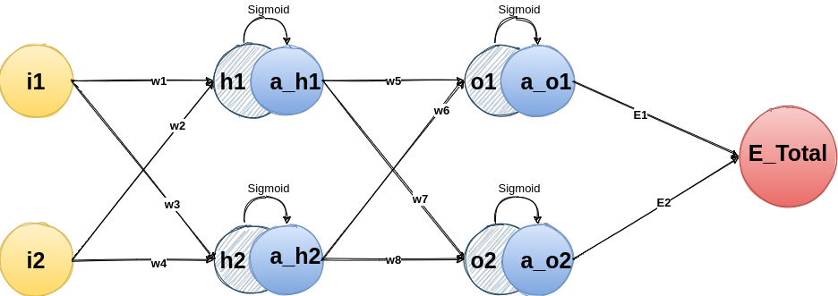
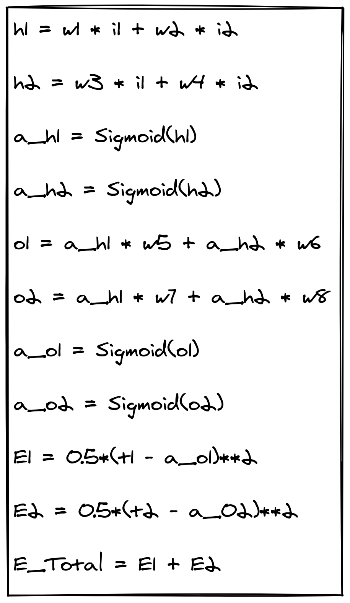
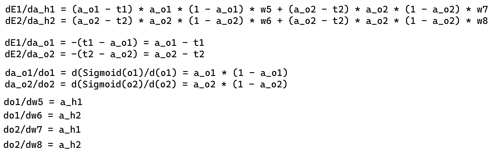
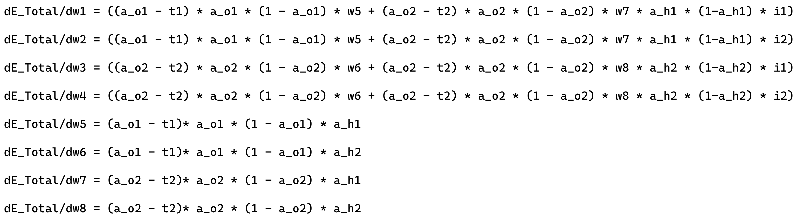
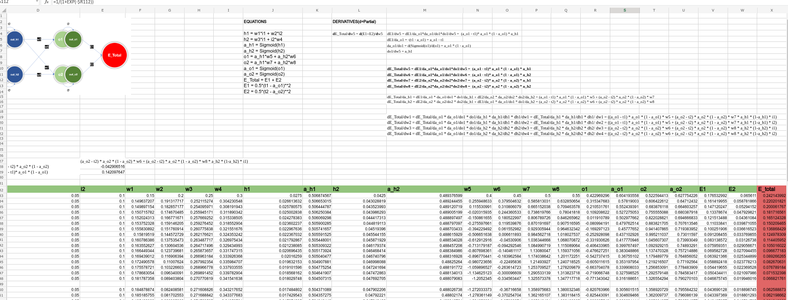
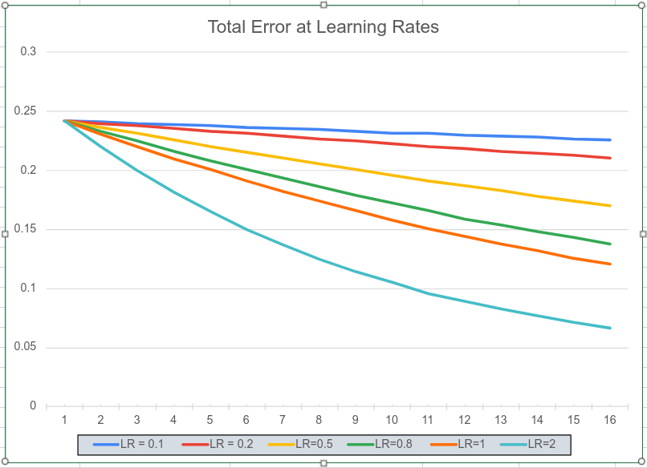

# EVA6-S4

* ## What is this project all about?

    CSV Sheet explaining Backpropagation with each step demystified and an custom MNIST network with around 20k Params achieving 99.4% Validation accuracy.

* ## Key Concepts: 

    * ### BackPropagation

        Recursive process through which we can compute gradients in the Neural Network with the help of Chain Rule. 

    * ### Gradients

        Gradients aka Derivative is the rate of change of function wrt a particular variable. 
    
    * ### Loss Function

        Also called as error function, it acts as a main driving factor to update weights and get the neural network work in the right way. 

* ## Now why CSV?

    It's easy to represent Neural Network params here and also it's underrated.

* ## BackPropagation Explained

So let's consider a simple Neural network with 2 inputs, 2 outputs and 1 hidden layer. Here are the equations for each variable in this network

We calculate the gradients wrt weights, and we want to minimize Total Error(E_Total). So let's try doing that from the output layer

    dE_Total/dw5 = (dE1+dE2)/dw5

but since w5 has no effect on E2, it's 0, 

so  

    dE_Total/dw5 = dE1/dw5 = dE1/da_o1 * da_o1/do1 * do1/dw5

similarly, 

    dE_Total/dw6 = dE1/da_o1 * da_o1/do1 * do1/dw6

    dE_Total/dw7 = dE2/da_o2 * da_o2/do2 * do2/dw7

    dE_Total/dw8 = dE2/da_o2 * da_o2/do2 * do2/dw8

Now gradient calculation for hidden layer is complete, moving onto first layer we need to make sure that we cover all parts of the network. So it's better to start from we left and calculate gradients wrt activated values of hidden layer, a_h1 and a_h2. 

    dE_Total/da_h1 = (dE1/da_o1 * da_o1/do1 * do1/da_h1) + (dE2/da_o2 * da_o2/do2 * do1/da_h1)

    dE_Total/da_h2 = (dE1/da_o1 * da_o1/do1 * do1/da_h2) + (dE2/da_o2 * da_o2/do2 * do2/da_h2)

For calculating gradients in First layer, we can proceed like this:

    dE_Total/dw1 = dE_Total/da_h1 * da_h1/dh1 * dh1/dw1

similarly, 

    dE_Total/dw2 = dE_Total/da_h1 * da_h1/dh1 * dh1/dw2

    dE_Total/dw3 = dE_Total/da_h2 *  da_h2/dh2 * dh2/dw3

    dE_Total/dw4 = dE_Total/da_h2 * da_h2/dh2 * dh2/dw4

Next let's calculate the gradient values

and here are the final derivatives:

Now we can calculate run our Excel based Neural Network. Some fixed inputs are being passed with **i1 = 0.05** and **i2 = 0.1**, along **t1 = 0.05** and **t2 = 0.09**

Here are the results!

* Link to 

I would like to highlight 3 points
 
    * As expected, higher the learning rate, higher the change in Total Error and vice versa.s

    * For initial few epochs, it seems as if Total Error for different learning rates are almost the same.

    * With smaller learning rate you need more steps to reach the minimum, while for higher value it diverges quickly. So it should be somewhere in the middle. 

## MNIST_Net Explained

**Model Keypoints**
1. 2 Convolution Blocks
2. BatchNormalization after each layer
3. Dropout of 3% at the end of each block 
4. AvgPool & MaxPool once
5. **16706** Parameters
5. Global Average Pooling at last

**Average Validation Accuracy: 99.35%**

## Training Logs

