##### S5 Assignment

Assignment Task:

    *Your new target is:
        99.4% (this must be consistently shown in your last few epochs, and not a one-time achievement)
        Less than or equal to 15 Epochs
        Less than 8000 Parameters
    *Do this in minimum 5 steps
    *Each File must have "target, result, analysis" TEXT block (either at the start or the end)
    *You must convince why have you decided that your target should be what you have decided it to be, and your analysis MUST be correct. 
    *Evaluation is highly subjective, and if you target anything out of the order, marks will be deducted. 
    *Explain your 5 steps using these target, results, and analysis with links to your GitHub files
    *Keep Receptive field calculations handy for each of your models. 
    *When ready, attempt S5-Assignment Solution

#### Model Names

* DilatedNet - Added Dilation in couple of layers.
* NonDilatedNet - NeuralNet without dilated convolution
* NoFCNet - NeuralNet with no fully connected layers.

### **Model 1 - DilatedNet** 

.ipynb)

* **Target**: *Improve model RF*
* **Strategy**: Increase number of channels and also add dilated convolution.
* **Model Info**: 
	* DropOut = 0.05.
	* BatchNormalization after every Conv layer.
	* Receptive Field - 22x22
	* Data Augmentation - RandomRotation(-7,7), ColorJitter(brightness=0.5)

* **Result**: 
	* Total Parameters: 6874
	* Highest Train Accuracy: 98.76%(15th Epoch)
	* Highest Test Accuracy: 99.27%(15th Epoch)
* **Analysis**:
	* Not an Overfitting Model. 
	* Consistent model with overall accuracy of 99% change.

* **Model Results**:

|Accuracy | Loss | LR & Misclassified |
|:-------------------------:|:-------------------------:|:-------------------------:|
|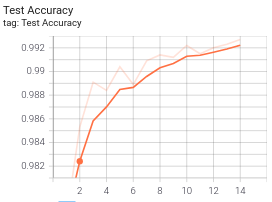   |  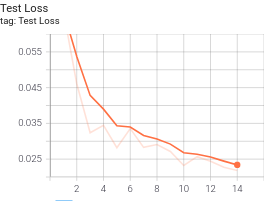|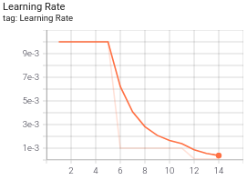|
|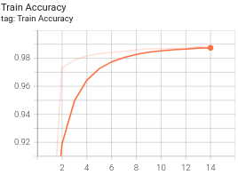  |  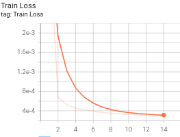|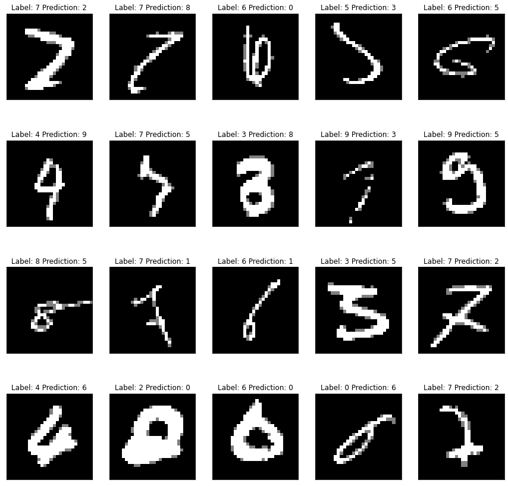|

### **Model 2 - NonDilatedNet**

.ipynb)

* **Target**: *Improve Test and Train Accuracy.*
* **Strategy**: No Dilation and use vanilla Convolution layers
* **Model Info**: 
	* DropOut = 0.05
	* BatchNormalization after every Conv layer.
	* Receptive Field = 22x22
	* Data Augmentation - RandomRotation(-7,7), ColorJitter(brightness=0.5)

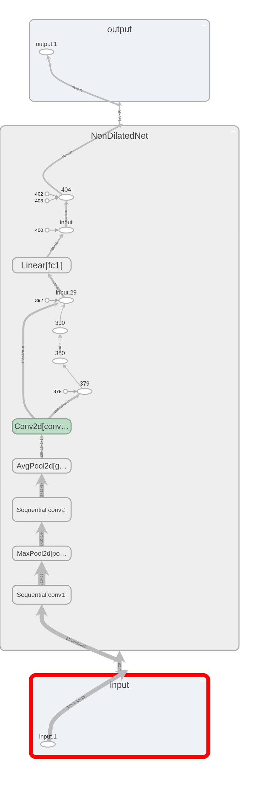

* **Result**: 
	* Total Parameters: 7276
	* Highest Train Accuracy: 98.75%
	* Highest Test Accuracy: 99.21%
	* Corresponding Epoch: 14
* **Analysis**:
	* Both Test & Train Accuracies are almost the same. 
	* The model is underfitting a bit.
	* Got stuck in 99.1 - 99.2 loop. Couldn't push forward with this architecture, so try convolving till channel size equals 6x6

* **Model Results**:

|Accuracy | Loss | LR & Misclassified |
|:-------------------------:|:-------------------------:|:-------------------------:|
|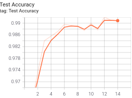  |  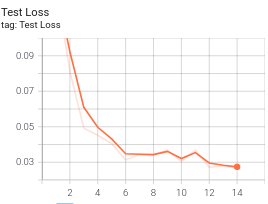|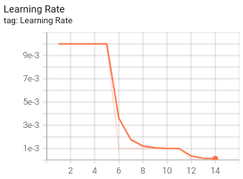|
|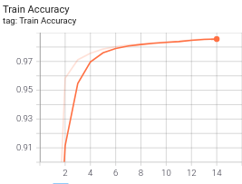  |  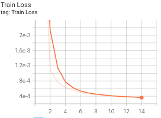|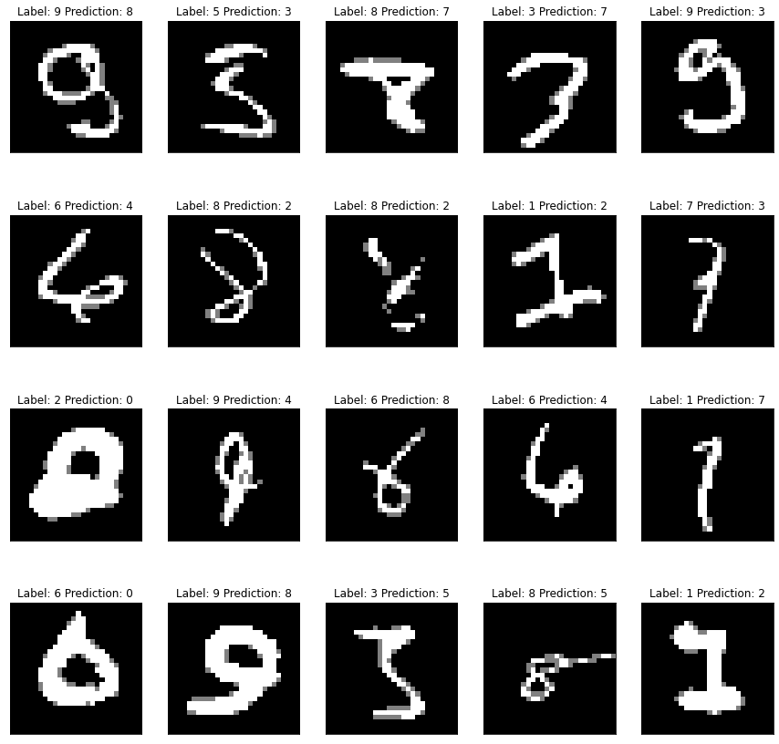|

### **Model 3 - NoFCNet**

.ipynb)

* **Target**: *Improve the model results i.e Get Model Accuracy >= 99.4% on a consistent basis*
* **Strategy**: Experiment with different LR Schedules especially with ReduceLROnPlateau & StepLR. Don't use any Fully-Connected Layers
* **Model Info**: 
	* DropOut = 0.05(after every layer).
	* BatchNormalization after every Conv layer.
	* Receptive Field - 22x22
	* Data Augmentation - RandomRotation(-7,7), ColorJitter(brightness=0.5)

<!--  -->
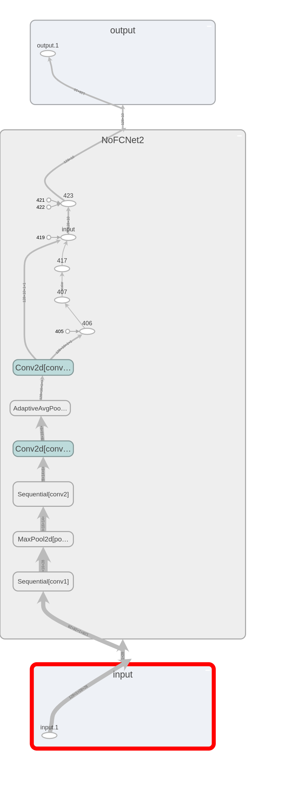

* **Result**: 
	* Total Parameters: 6,490
	* Highest Train Accuracy: 98.8450%
	* Highest Test Accuracy: 99.37%
	* Corresponding Epoch: 11
* **Analysis**:
    * The model has achieved 99.3% of accuracy on consistent basis( in 4 Epochs). 
    * Now the model is not Overfitting and all cheers to DropOut.
* **Model Results**:

|Accuracy | Loss | LR & Misclassified |
|:-------------------------:|:-------------------------:|:-------------------------:|
|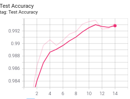  blah |  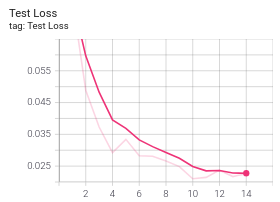|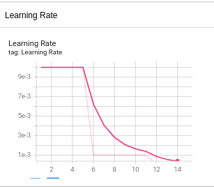|
|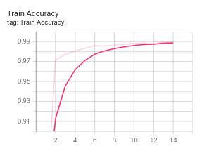  |  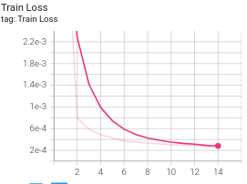|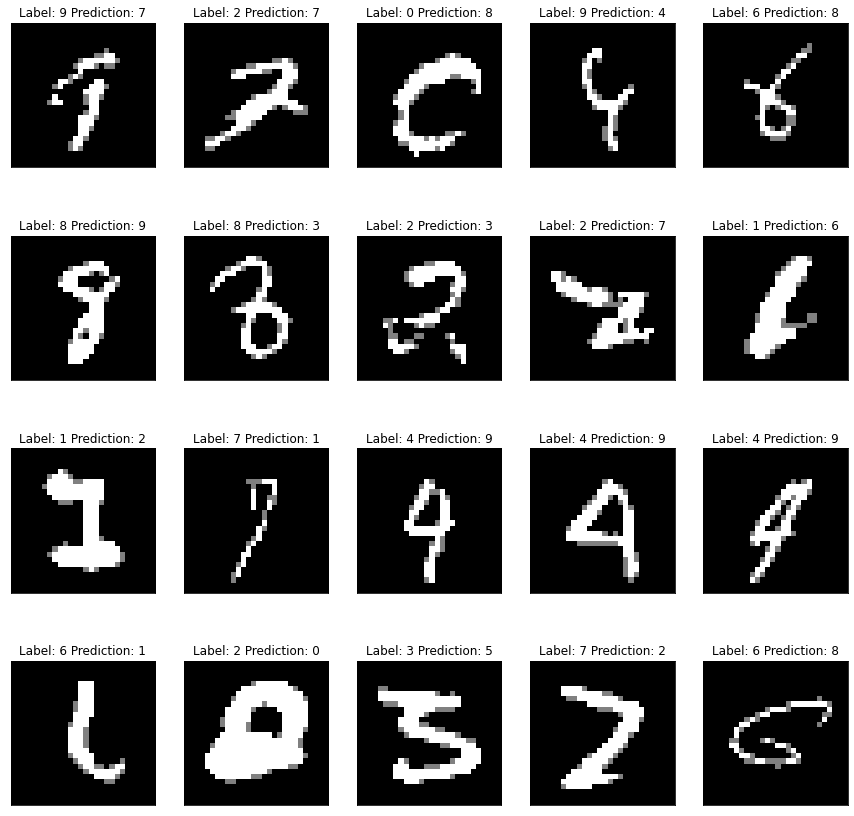|
<!-- <--|  |  || --> 
