# S7 Assignment

Task: Your assignment 7 is:

        Run this network.
        Fix the network above:
        change the code such that it uses GPU
        change the architecture to C1C2C3C40  (No MaxPooling, but 3 3x3 layers with stride of 2 instead) (If you can figure out how to use Dilated kernels here instead of MP or strided convolution, then 200pts extra!)
        total RF must be more than 44
        one of the layers must use Depthwise Separable Convolution
        one of the layers must use Dilated Convolution
        use GAP (compulsory):- add FC after GAP to target #of classes 
        (optional)

        use albumentation library and apply:
        
            horizontal flip
            shiftScaleRotate
            coarseDropout (max_holes = 1, max_height=16px, max_width=1, min_holes = 1, min_height=16px, min_width=16px, fill_value=(mean of your dataset), mask_fill_value = None)

        achieve 85% accuracy, as many epochs as you want. Total Params to be less than 200k. 
        
Assignment Solution: 

# MODEL 1:

[CIFAR-10 Model](https://github.com/Gilf641/EVA-6/blob/main/Assignments/S7/S7_Assignment.ipynb)
        
        
* **Model Features:**

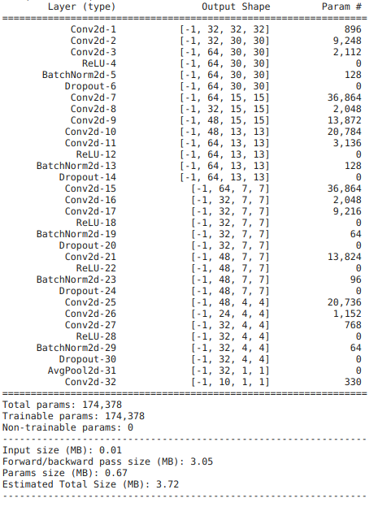

1. Used GPU
2. Receptive Field = 49
3. Total Params = 174_378
3. Used Depthwise Separable Convolution
4. Used Dilated Convolution
5. Since the model was overfitting, I used Dropout of 6%.
6. Ran the model for 50 Epochs
7. Max Validation Accuracy = 83%

# Main Assignment

**[S7 Assignment Solution](Assignments/S7/S7_Assignment.ipynb)**

Modularized the pipeline, now I have a model package, from where I can import any model and run inside colab. 

## Model Performance Analysis

|Accuracy| Loss|
|-------------------------|-------------------------|
|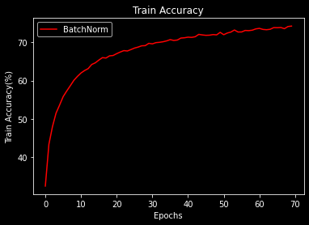|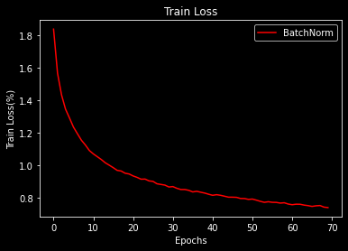|
|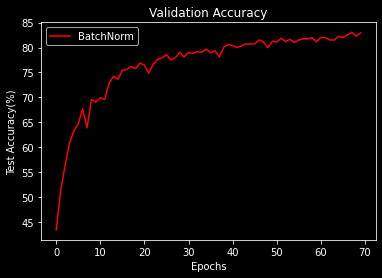|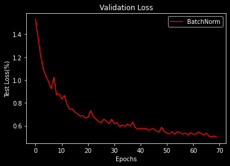|

* **Misclassified images**
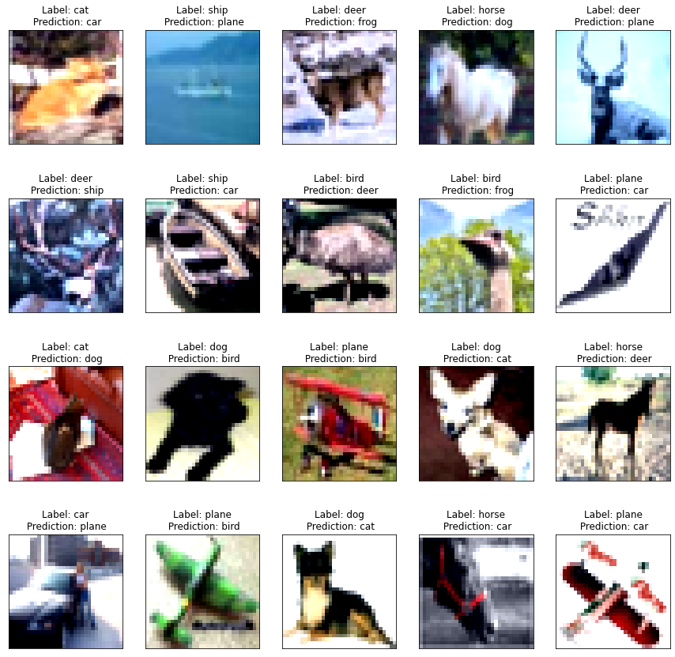

# Analysis

1. Adding Dilation doesn't mean increase in accuracy
2. As expected Depthwise Convolution, did reduce the accuracy at the cost of less params.
3. Without Dilation, Classifier would perform much better. 

# MODEL 2:

[CIFAR-10 Model](https://github.com/Gilf641/EVA-6/blob/master/Assignments/S7/S7_Assignment(168k_RF85).ipynb)
        
        
* **Model Features:**

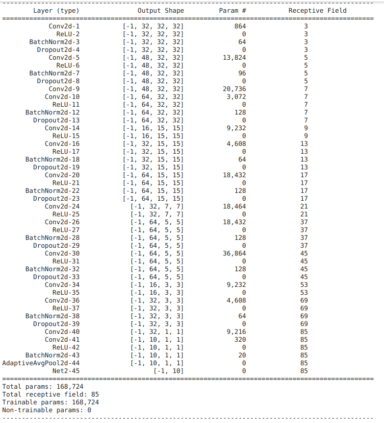

1. Used GPU
2. Receptive Field = 85
3. Total Params = 168_724
3. Used 2 Depthwise Separable Convolution layers
4. Used 1 Dilated Convolution layer
5. Since the model was overfitting, I used Dropout of 5%.
6. Ran the model for 100 Epochs
7. Max Validation Accuracy = 85.5%

# Main Assignment

**[S7 Assignment Solution](https://github.com/Gilf641/EVA-6/blob/master/Assignments/S7/S7_Assignment(168k_RF85).ipynb)**

Modified [my torch package](https://github.com/Gilf641/EVA-6/tree/master/torchkit) by adding torchsummary with a Receptive Field Column . This makes the process slightly easier

## Model Performance Analysis

|Accuracy| Loss|
|-------------------------|-------------------------|
|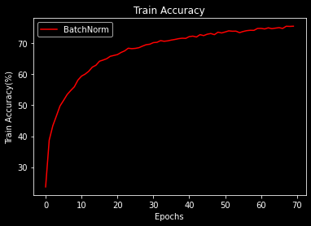|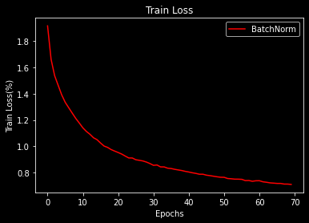|
|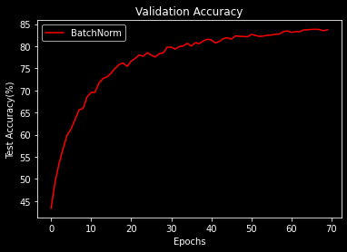|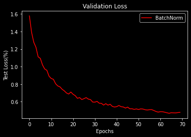|

* **Misclassified images**
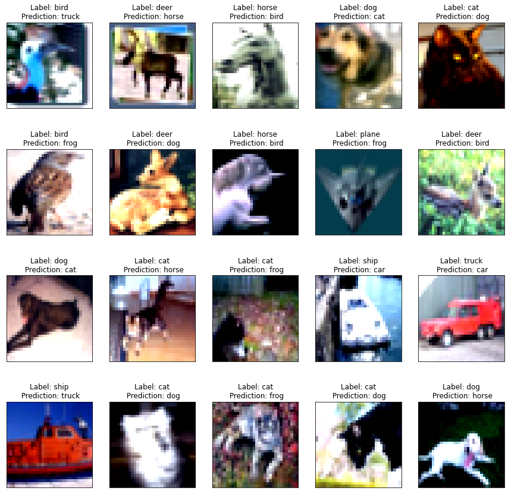

# Analysis

1. Adding Dilation especially in the initial layers, doesn't improve model performance
2. OnecycleLr has affected and improved model accuracy rate.
