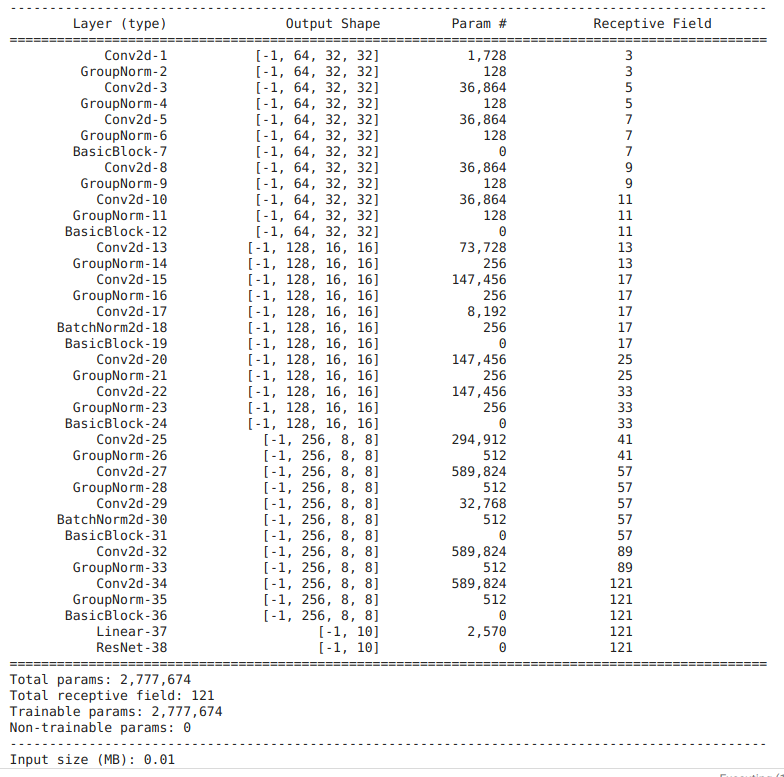
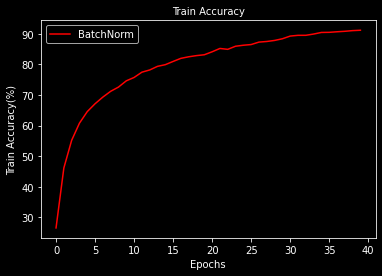
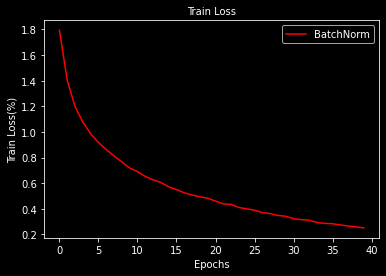
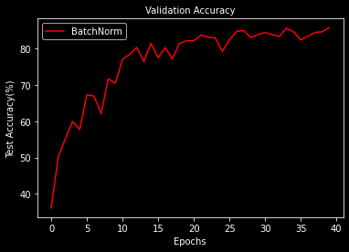
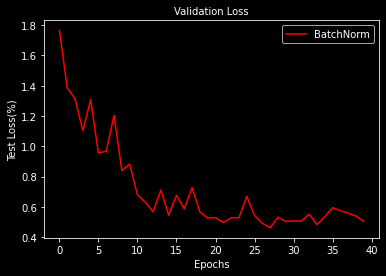
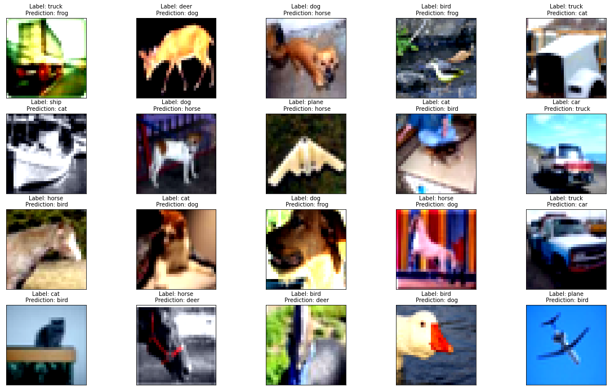
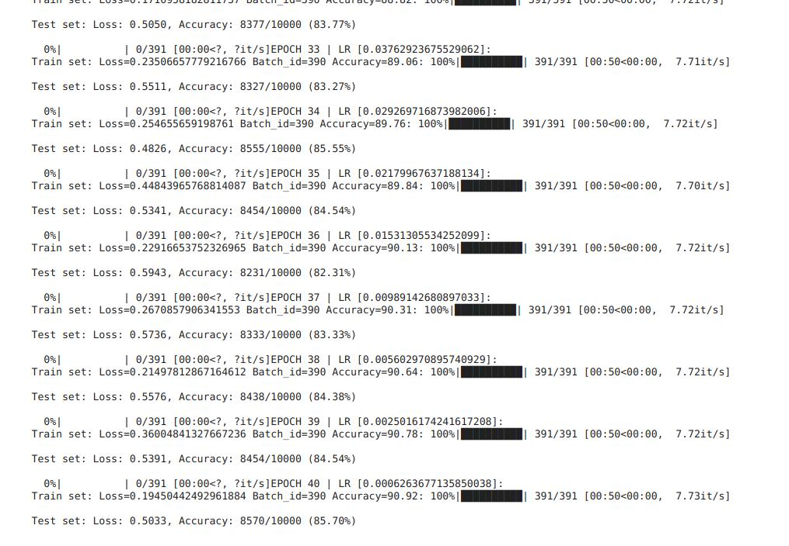

# S8 Assignment

Task: 

    Go through this repository: https://github.com/kuangliu/pytorch-cifar (Links to an external site.)
    Extract the ResNet18 model from this repository and add it to your API/repo. 
    Use your data loader, model loading, train, and test code to train ResNet18 on Cifar10
    Train for 40 Epochs
    20 misclassified images
    20 GradCam output on the SAME misclassified images
    Apply these transforms while training:
    RandomCrop(32, padding=4)
    CutOut(16x16)
    Rotate(±5°)
    Must use ReduceLROnPlateau
    Must use LayerNormalization ONLY

### Assignment Solution: [ResNet Model](https://github.com/Gilf641/EVA-6/blob/master/Assignments/S8/S8_Assignment.ipynb)

### Custom Torch Package: [torchly](https://github.com/Gilf641/torchly)
## **Model Features:**

1. Used GPU
2. ResNet Variant: ResNet18
3. Total Params: 2,777,674
4. Used only 3 basic blocks, to get final output > 7x7 for Gradcam.
5. Used NLLoss() to calculate loss value.
7. Ran the model for 40 Epochs with 

        * Highest Train Accuracy: 90.92% 

        * Corresponding Test Accuracy: 85.7% 

        
        
* **Model Features:**

1. Used GPU
2. Receptive Field = 85
3. Total Params = 168_724
3. Used 2 Depthwise Separable Convolution layers
4. Used 1 Dilated Convolution layer
5. Since the model was overfitting, I used Dropout of 5%.
6. Ran the model for 100 Epochs
7. Max Validation Accuracy = 85.5%

## **Model Analysis**
1. Lot of fluctuations in Validation Acc values. 
2. Overfit Model, need to add Dropout.

## Model Performance Analysis

|Accuracy| Loss|
|-------------------------|-------------------------|
|||
|||

* **Misclassified images**

* **Model logs**

# Analysis

1. Network is currently overfitting.
2. OnecycleLr has affected and improved model accuracy rate.
3. LayerNorm seems to have positive impact on model results. But on reducing batch-size, probably it can reach to BatchNorm's height

