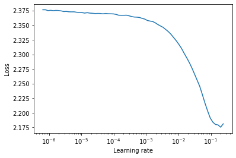
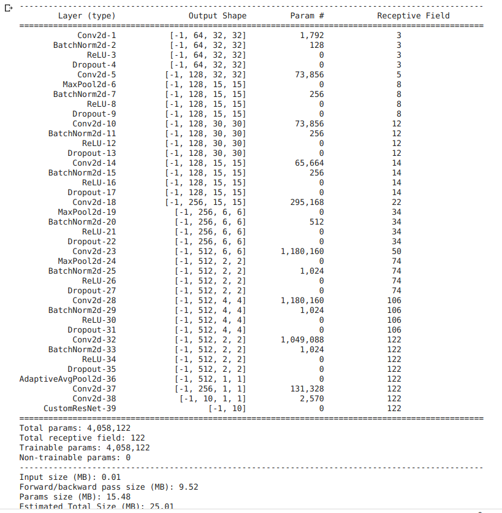
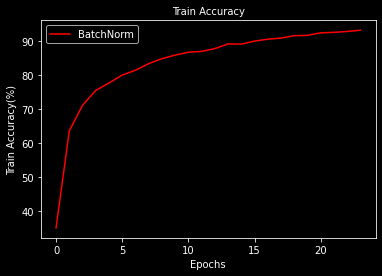
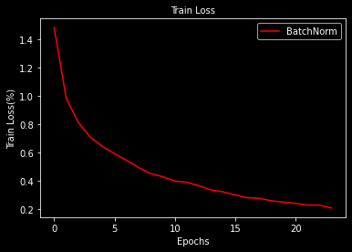
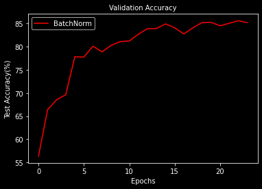
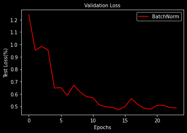
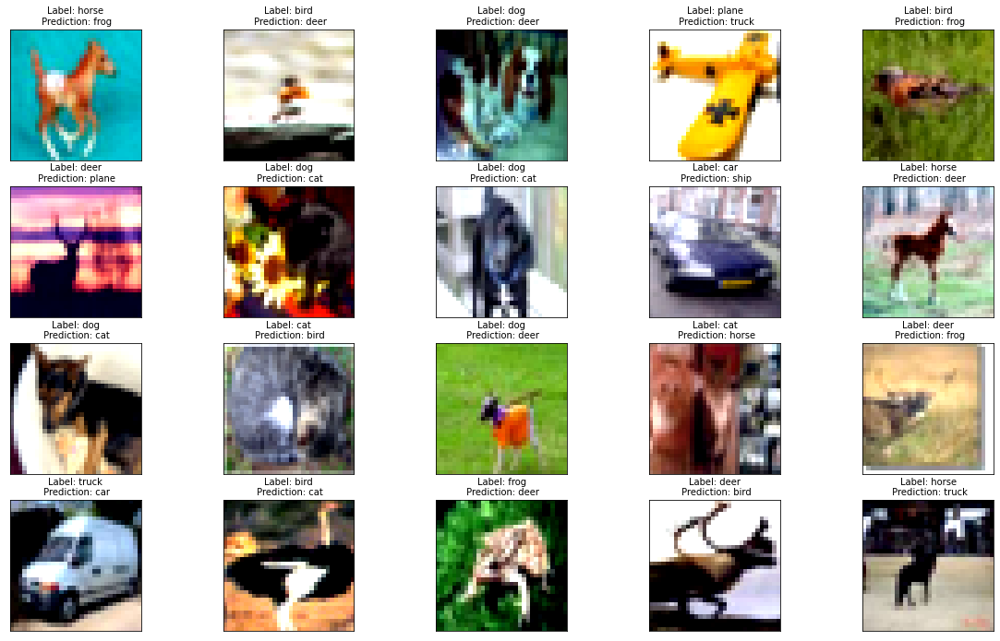
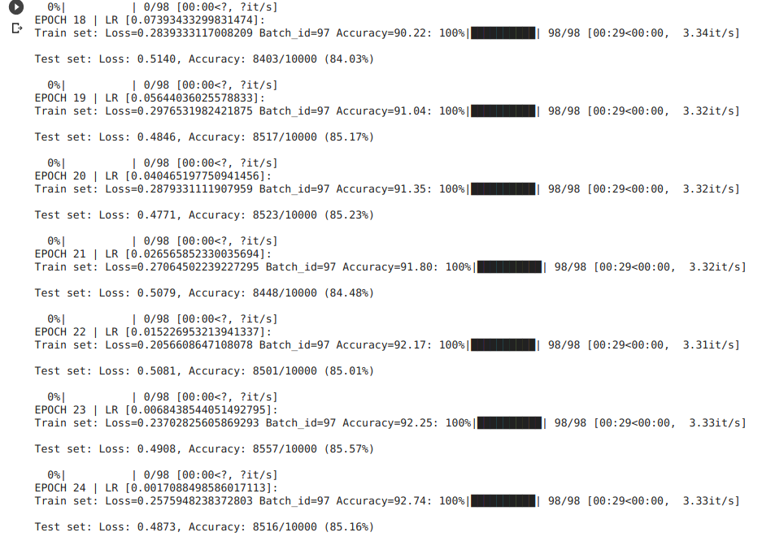

# S9 Assignment

Task: 

    Write a custom ResNet architecture for CIFAR10 that has the following architecture:
        PrepLayer - Conv 3x3 s1, p1) >> BN >> RELU [64k]
        Layer1 -
        X = Conv 3x3 (s1, p1) >> MaxPool2D >> BN >> RELU [128k]
        R1 = ResBlock( (Conv-BN-ReLU-Conv-BN-ReLU))(X) [128k] 
        Add(X, R1)
        Layer 2 -
        Conv 3x3 [256k]
        MaxPooling2D
        BN
        ReLU
        Layer 3 -
        X = Conv 3x3 (s1, p1) >> MaxPool2D >> BN >> RELU [512k]
        R2 = ResBlock( (Conv-BN-ReLU-Conv-BN-ReLU))(X) [512k]
        Add(X, R2)
        MaxPooling with Kernel Size 4
        FC Layer 
        SoftMax
    Uses One Cycle Policy such that:
    Total Epochs = 24
    Max at Epoch = 5
    LRMIN = FIND
    LRMAX = FIND
    NO Annihilation
    Uses this transform -RandomCrop 32, 32 (after padding of 4) >> FlipLR >> Followed by CutOut(8, 8)
    Batch size = 512
    Target Accuracy: 90% (93% for late submission or double scores). 
    NO score if your code is not modular. Your collab must be importing your GitHub package, and then just running the model. I should be able to find the custom_resnet.py model in your GitHub repo that you'd be training. 
    Once done, proceed to answer the Assignment-Solution page. 

**Assignment Solution**: [CustomResNet Model Notebook](https://github.com/Gilf641/EVA-6/blob/master/Assignments/S9/S9_Assignment.ipynb)

## **Model Features:**

1. Used GPU
2. ResNet Variant: CustomResNet
3. Total Params: 4_058_122
4. Used only 2 basic blocks, with double residue.
5. Implemented LR Finder to calculate lr at which loss value is low.
5. Used NLLoss() to calculate loss value.
7. Ran the model for 20 Epochs with 

    * Highest Train Accuracy: 92.74% 

    * Corresponding Test Accuracy: 85.16% 

  
        
* **Model Features:**

1. Used GPU
2. Receptive Field = 122
3. Total Params = 4_058_122
4. Ran the model for 24 Epochs
5. Max Validation Accuracy = 85.16%

## **Model Analysis**
1. Lot of fluctuations in Validation Acc values. 
2. Overfit Model, need to add Dropout.

## Model Performance Analysis

|Accuracy| Loss|
|-------------------------|-------------------------|
|||
|||

* **Misclassified images**

* **Model logs**

# Analysis

1. Network is currently overfitting.
2. OnecycleLr has affected and improved model accuracy rate.
3. Adding Residual layers, does increase the accuracy.

