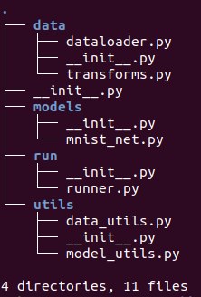

### torchkit is PyTorch utility package which helps you build customized Deep Learning Pipeline.

Since PyTorch is pythonic in nature, you can create and customize your own pipeline. Currently in developing stage, haven't added a lot of features. 

#### File Structure

* **data** consists of dataloader and transforms module. Dataloader helps you convert custom dataset to a dataloader object. For built-in datasets, I'll directly write a dataset-loader. In Transforms module, defined train and test transforms, using torchvision.transforms. Will switch to albumentations, as it's much faster than transforms.

* **models** has a network module, which is mainly based on MNIST dataset. 

* **run** does the training and testing of NeuralNet. Integrated Tensorboard for neat data visualization.

* **utils** consists of data and model utils. Data utils helps in plotting misclassified inputs, while model utils has model related utility functions.

#### NewFeatures to add

* Receptive Field Calculation
* Integrate with tensorwatch
